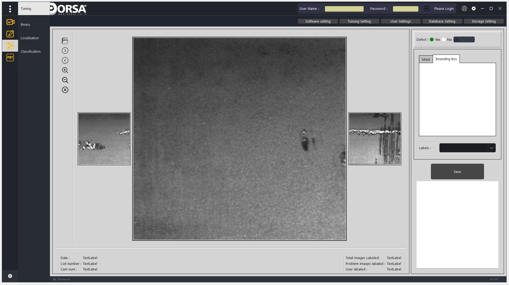

!First GUI

<!-- The bellow command will remove git version control on folder (Train_modules/deep_utils/__pycache__/) which you had version control on them. the files which you added to .gitignore before of running git control -->
git rm -r --cached Train_modules/deep_utils/__pycache__/

